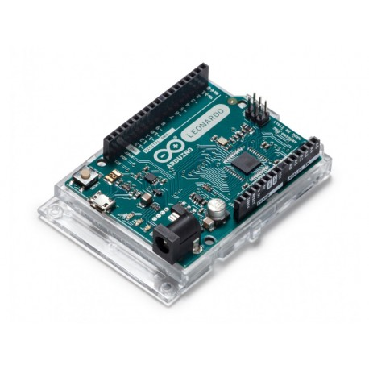
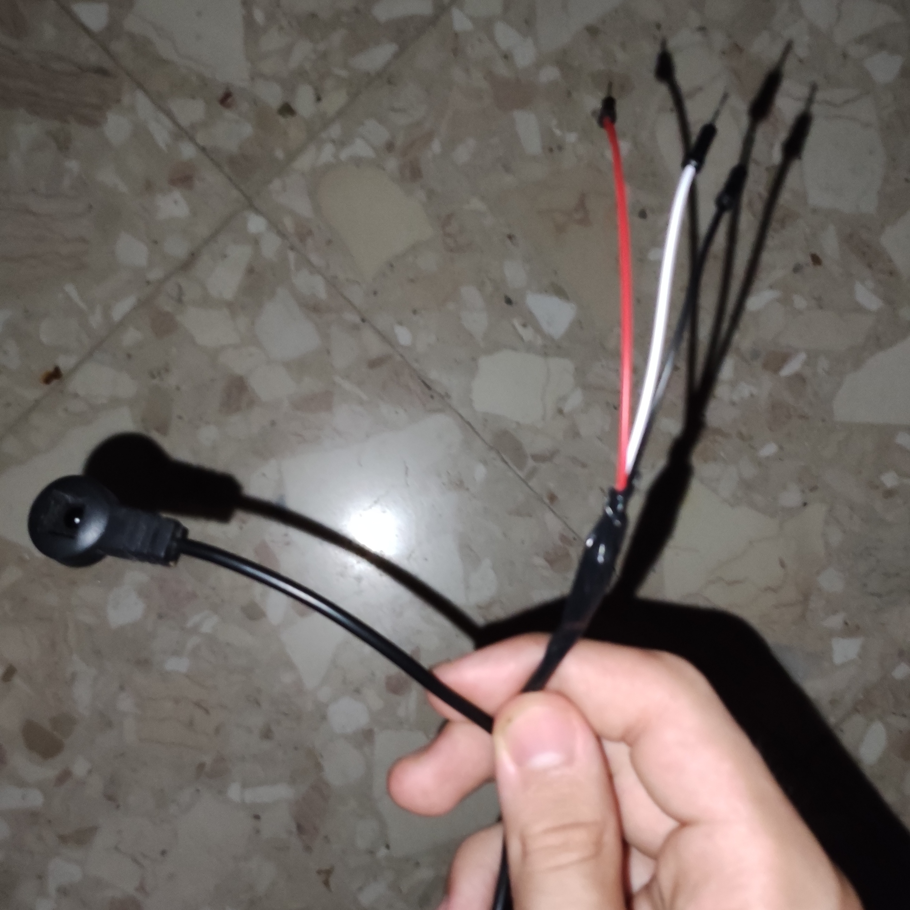
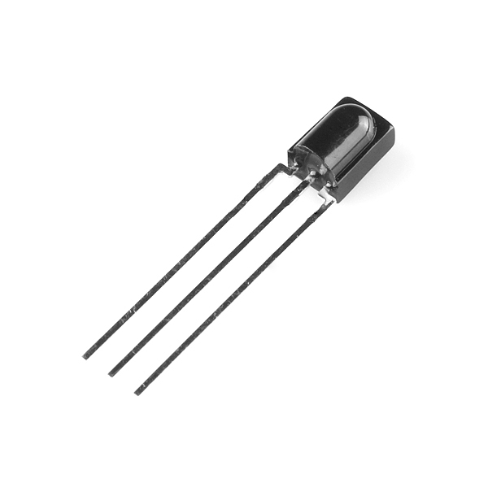

# IR Vim

https://user-images.githubusercontent.com/71498817/182047050-8cb6e54d-a0f2-489a-97b5-e2088d85da75.mp4

## What is this?

A way to connect your TV, speakers, RGB, etc. remote to your PC. Thanks to its innovative **modal system**, you will never again have to leave the sofa while watching a film to pause or change the volume.

## The modal system

The name of this project comes from Vim, a modal text editor.  
If you are going to use a remote you also control another device with, you will have a very small amount of buttons you can utilize for your PC without interfering with the other device.  
So here comes in the **modal system**, which allows to assign different actions to the same key based on the mode you're in: you can have a volume control mode, a video navigation mode, a music player mode... the only limit is your imagination! ~~and also the memory on your Arduino.~~

## Important warning

### Arduino UNO

The Arduino UNO doesn't support HID, but it is still possible to make it work in a very hacky way (read carefully [here](https://mitchtech.net/arduino-usb-hid-keyboard/)). It basically involves writing binary data to serial and using a special firmware. This means that if you use any `Serial.print()`, you will break everything unless you make it so it is only executed when `#define SERIAL_DEBUG` is present.

### HID-compatible boards

Currently, this is not going to work on boards which actually support HID, but I will very soon get my hands on one of them and make the code work (which requires just a very few simple additions).

## How to?

### Materials

You will need:

-   An Arduino UNO or (better) any Arduino board with HID support, like the Artduino Leonardo.
-   An IR sensor, which you can buy or salvage from an old TV decoder like me if you want to do a little bit of soldering.

<p align="middle">
    
    </a>
    
</p>

### Cicuit

Just connect the power (red) to the 5V header, the ground (black) to one of the GND headers and the signal into any of the analog or digital headers. Make sure to read your IR receiver datasheet to know which pins correspond to what. If you're using a decoder IR receiver, the wires are usually color-coded.

### Software

I used PlatformIO with VSCode to make this, but the Arduino IDE should work fine.

### Before uploading the code to the Arduino!

You need to edit the `src/main.cpp` file and:

-   Specify the pin you connected your sensor to by editing the `#define IRMP_INPUT_PIN` line.
-   Edit this section to configure your keys

```cpp
#define MODAL_KEY 0xB946  // Goes to the next mode or 0 after reaching the end
#define MODE_0_KEY 0xA758 // This key sets the mode to 0
#define MODES 3           // Number of available modes
const Mapping key_mappings[MODES][4] = {

    // Mode 0: Main mode
    {{0xBA45, KEY_SPACE, 0, "Play/Pause (Space)"},
     {0xB847, KEY_MUTE, 0, "Mute"},
     {0xB54A, KEY_VOLUMEDOWN, 1, "Volume down"},
     {0xB748, KEY_VOLUMEUP, 1, "Volume up"}},

    // Mode 1: Fullscreen and video navigation
    {{0xBA45, KEY_F, 0, "F"},
     {0xB847, KEY_0, 0, "0"},
     {0xB54A, KEY_J, 1, "J"},
     {0xB748, KEY_L, 1, "L"}},

    // Mode 2: Video navigation by number
    {{0xBA45, KEY_1, 0, "1"},
     {0xB847, KEY_3, 0, "3"},
     {0xB54A, KEY_6, 0, "6"},
     {0xB748, KEY_9, 0, "9"}},

};
```

-   This section of the code explains how the configuration works

```cpp
// Contains all the information needed for one key association
typedef struct {
  uint32_t ir_code;        // IR code to be detected
  uint8_t kb_code;         // Keyboard HID code to be sent
  bool is_repeatable;      // Will holding down be ignored?
  String serial_debug_msg; // Debug message
} Mapping;
```

-   To find out the IR codes you need, upload to the Arduino, open the serial monitor and press the buttons on your remote.

-   Once everything is ready and you made sure to [read the important warning](#important-warning), comment out the `#define SERIAL_DEBUG` line at the beginning of the file and upload.
